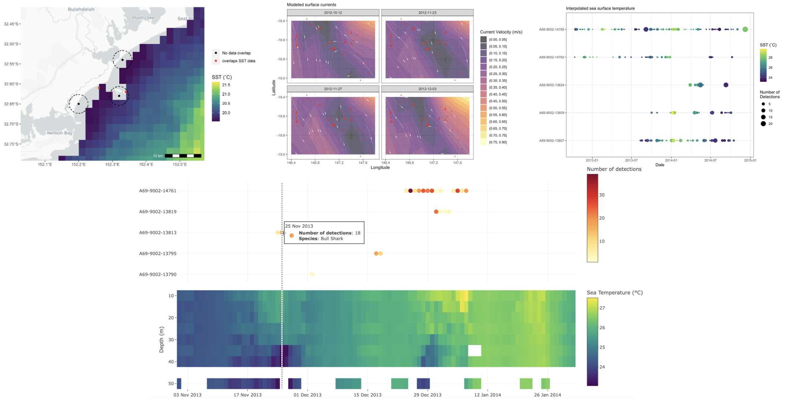
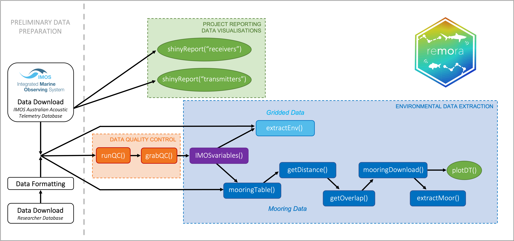
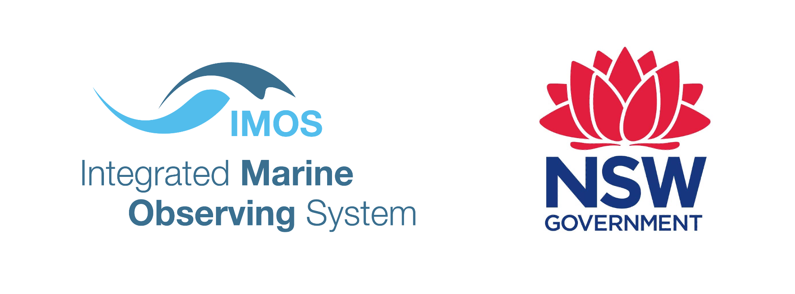

[](https://github.com/IMOS-AnimalTracking/remora)
[](https://zenodo.org/badge/latestdoi/411668033)
[](https://github.com/IMOS-AnimalTracking/remora/issues)
[](https://github.com/IMOS-AnimalTracking/remora)
[](https://github.com/IMOS-AnimalTracking/remora)
[](https://github.com/IMOS-AnimalTracking/remora)


main branch:
[](https://github.com/IMOS-AnimalTracking/remora/actions)

staging branch:
[](https://github.com/IMOS-AnimalTracking/remora/actions)

<p align="center">
  
</p>

<h1 align="center"><span style="color:#BEBEBE">re</span><span style="color:#808080"><b>mo</b></span><span style="color:#BEBEBE">ra</span></h1>
<h4 align="center">An R package to facilitate the Rapid Extraction of Marine Observations for Roving Animals</h4>

<p align="center">
  <a href="#overview">Overview</a> •
  <a href="#installation">Installation</a> •
  <a href="#key-functionalities">Key functionalities</a> •
  <a href="#what-to-do-if-you-encounter-a-problem">Issues</a> •
  <a href="#how-to-contribute">Contributions</a> •
  <a href="#acknowledgements">Acknowledgements</a> •
  <a href="#data-accessibility">Data accessibility</a> •
  <a href="#licence">Licence</a>
</p>

<p align="center">



</p>

<br>

## Overview
**remora** is an R package enabling the integration of animal acoustic telemetry data with oceanographic observations collected by ocean observing programs. It includes functions for:

- Interactively exploring animal movements in space and time from acoustic telemetry data
- Performing robust quality-control of acoustic telemetry data as described in [Hoenner et al. 2018](https://doi.org/10.1038/sdata.2017.206) 
- Identifying available satellite-derived and sub-surface *in situ* oceanographic datasets coincident and collocated with the animal movement data, based on regional Ocean Observing Systems  
- Extracting and appending these environmental data to animal movement data  

Whilst the functions in **remora** were primarily developed to work with acoustic telemetry data, the environmental data extraction and integration functionalities will work with other spatio-temporal ecological datasets (eg. satellite telemetry, species sightings records, fisheries catch records).

## Installation
**remora** requires R version >= 3.6.0

You will need the remotes package to install **remora**:

```r
install.packages("remotes")
library("remotes")     
```
The latest stable version of **remora** can be installed from GitHub:

```r
remotes::install_github('IMOS-AnimalTracking/remora', build_vignettes = TRUE, dependencies = TRUE)
```

## Key functionalities
<p align="center">
  
</p>

A set of functions within the **remora** workflow allow users to run each of the below functionalities independently, as required. 

- Interactive visualisation of data associated with an acoustic telemetry receiver array
- Interactive visualisation of data associated with an acoustic telemetry tagging project
- Quality control of acoustic telemetry data
- Integration with remotely-sensed or gridded environmental data  
- Integration with *in situ* sub-surface oceanographic moooring data

The vignettes for each functionality can be accessed in R using the following code:  

```r
browseVignettes(package = "remora")
```

## What to do if you encounter a problem

If you are convinced you have encountered a bug or
unexpected/inconsistent behaviour when using remora, you can post an
issue [here](https://github.com/IMOS-AnimalTracking/remora/issues). First, have
a read through the posted issues to see if others have encountered the
same problem and whether a solution has been offered. You can reply to
an existing issue if you have the same problem and have more details to
share or you can submit a new issue. 

To submit an issue, you will need
to *clearly* describe the issue, include a reproducible
example, describe what you expected to
happen (but didn’t), and provide screenshots/images that illustrate the problem.

## How to Contribute

Contributions from anyone in the Movement Ecology/Acoustic Telemetry
communities are welcome. Consider submitting a feature request
[here](https://github.com/IMOS-AnimalTracking/remora/issues/new/choose) to start
a discussion. Alternatively, if your idea is well-developed then you can
submit a pull request for evaluation
[here](https://github.com/IMOS-AnimalTracking/remora/pulls).


## Acknowledgements
<p align="left">
   
</p>

This work was funded by Australia’s Integrated Marine Observing System (IMOS, www.imos.org.au) and a Research Attraction and Acceleration Program grant from the Office of the New South Wales Chief Scientist & Engineer awarded to Sydney Institute of Marine Science. IMOS is enabled by the National Collaborative Research Infrastructure Strategy (NCRIS). It is operated by a consortium of institutions as an unincorporated joint venture, with the University of Tasmania as Lead Agent. 

We thank Michelle Heupel, Colin Simpfendorfer and Paul Butcher for allowing us access to the following sample datasets to aid code development.

Heupel, M., Simpfendorfer, C. *et al.* (2021) Townsville Reefs (Available: Integrated Marine Observing System. Animal Tracking Database. https://animaltracking.aodn.org.au. Accessed: 2021-10-11).

Butcher, P. *et al.* (2021) NSW DPI (Whaler, White and Tiger Shark Program). NSW Department of Primary Industries. (Available: Integrated Marine Observing System. Animal Tracking Database. https://animaltracking.aodn.org.au. Accessed: 2021-10-11).

## Data accessibility
- Continental-scale acoustic telemetry data collated as part of Australia’s Integrated Marine Observing System (IMOS) are available via the [IMOS Australian Animal Acoustic Telemetry Database](https://animaltracking.aodn.org.au). 

- Environmental and oceanographic datasets are available from the [IMOS Australian Ocean Data Network](https://portal.aodn.org.au/).


## Licence

 GNU General Public License (GPL>=3) https://www.gnu.org/licenses/gpl-3.0.en.html


**Citation:**  
Jaine, F., Jonsen, I., Udyawer, V., Dwyer, R., Scales, K., Maron-Perez, F., Hoenner, X., Huveneers, C and Harcourt, R. **remora**: An R package to facilitate Rapid Extraction of Marine Observations for Roving Animals. *In preparation* for publication in Methods in Ecology and Evolution. DOI:10.5281/zenodo.5763976. https://imos-animaltracking.github.io/remora/

**Contributors:**  

**Fabrice Jaine** @fjaine (IMOS Animal Tracking Facility, Sydney Institute of Marine Science)  
**Ian Jonsen** @ianjonsen (IMOS Animal Tracking Facility, Macquarie University)  
**Vinay Udyawer** @vinayudyawer (Australian Institute of Marine Science)  
**Ross Dwyer** @RossDwyer (University of the Sunshine Coast)  
**Kylie Scales** @KScales (University of the Sunshine Coast)  
**Francisca Maron** @fmaron (IMOS Animal Tracking Facility, Sydney Institute of Marine Science)  
**Xavier Hoenner** @xhoenner (Commonwealth Scientific and Industrial Research Organisation)  
**Charlie Huveneers** @huve0001 (Flinders University)  
