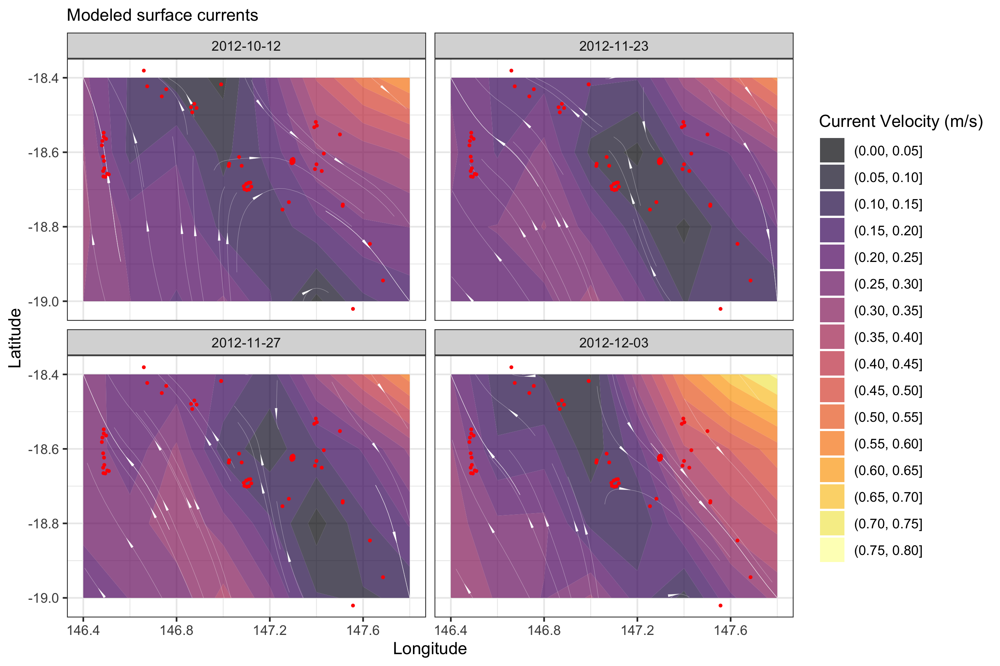

<p align="center">
  
</p>
<h1 align="center"><span style="color:#BEBEBE">re</span><span style="color:#808080"><b>mo</b></span><span style="color:#BEBEBE">ra</span></h1>
<h4 align="center">An R package to facilitate the Rapid Extraction of Marine Observations for Roving Animals</h4>

<p align="center">
  <a href="#overview">Overview</a> •
  <a href="#installation">Installation</a> •
  <a href="#main-functions">Main Functions</a> •
  <a href="#acknowledgements">Acknowledgements</a> •
  <a href="#data-accessibility">Data accessibility</a>
</p>

## Overview
remora ...




## Installation
You will need the remotes package to install re**mo**ra:

```r
install.packages("remotes")
library("remotes")     
```
The latest stable version of re**mo**ra can be installed from GitHub:

```r
remotes::install_github('IMOS-AnimalTracking/remora')
```

## Main Functions
Here is a tentative description of the main remora functions + the functional workflow diagram

A total of ... variables can be accessed and extracted using re**mo**ra...

### runQC
### extractEnv
### extractMoor
### shinyReport

## Acknowledgements
This work was funded by Australia’s Integrated Marine Observing System (IMOS, www.imos.org.au) and a Research Attraction and Acceleration Program grant from the Office of the New South Wales Chief Scientist & Engineer awarded to Sydney Institute of Marine Science. IMOS is enabled by the National Collaborative Research Infrastructure Strategy (NCRIS). It is operated by a consortium of institutions as an unincorporated joint venture, with the University of Tasmania as Lead Agent. 

## Data accessibility
Continental-scale acoustic telemetry data collated as part of Australia’s Integrated Marine Observing System (IMOS) are available through the IMOS Australian Animal Acoustic Telemetry Database (https://animaltracking.aodn.org.au). 


Oceanographic datasets are available from the IMOS Australian Ocean Data Network (www.aodn.org.au).

