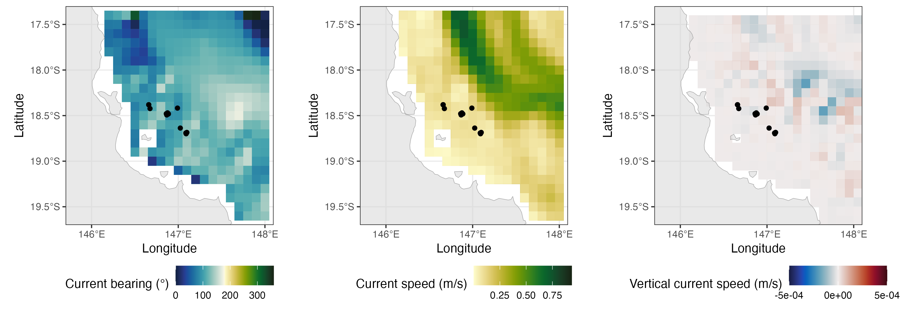

```{r, echo=FALSE, message=FALSE, warning=FALSE}
## working when developing vignette
require(tidyverse, quietly = TRUE)
require(remora, quietly = TRUE)

```

--------------------------------------

This functionality of the `remora` package allows users to integrate acoustic telemetry data and [Bluelink Reanalysis (BRAN)](https://research.csiro.au/bluelink/) environmental data. Since this is a reanalysis data with 10-km spatial resolution, the user will benefit from a dataset with daily resolution and no gaps, which are common in remotely sensed data due to cloud cover. Again, we advocate for users to first undertake a quality control step using the `runQC()` function and workflow before further analysis (see `vignette('runQC')`), however the functionality to append Bluelink (BRAN) environmental data will work on any dataset that has at the minimum spatial coordinates and a timestamp for each detection event. A benefit of using Bluelink (BRAN) data in your analyses of animal movements is that data can be obtained in *3D*, ranging from the ocean surface all the way to 4,509 m in depth. 

The `extractBlue()` function can be used to obtain environmental data **anywhere in the world**. 

<center>

{#id .class width=100%} 

</center>
 
<br>

# Types of environmental data

This function allows users to download and process a range of daily oceanographic variables (between 1993 - present) housed within the [Bluelink (BRAN)](https://research.csiro.au/bluelink/outputs/data-access/data-formats/). Information about the Bluelink (BRAN) variables currently avaiable for download using `remora` can be found using `imos_variables()`. These datasets can also be manually downloaded with daily, weekly or annual resolutions through the [NCI portal](https://dapds00.nci.org.au/thredds/catalog/gb6/BRAN/BRAN2020/catalog.html). 

<br>

Variables include current speed at both horizontal (in both x (u) and y (v) directions) and vertical planes (i.e. `ocean_w` will provide data on current speed in the vertical plane), and other environmental variables at depths ranging between the ocean surface to 4,905 m. 

```{r, warning=FALSE}
library(remora)

imos_variables()
```

<br>

In this vignette we will explore some examples for accessing and integrating Bluelink (BRAN) data, both at depth and at the water surface. 

<br>

# Usage of the `extractBlue()` function

## Load example dataset

The primary function to extract and append Bluelink (BRAN) data to telemetry data is the `extractBlue()` function.
Lets start with a dataset that has undergone quality control (see `vignette('runQC')`).

```{r, eval = FALSE, message=FALSE, warning=FALSE}
library(tidyverse)
library(raster)
library(ggspatial)

## Example dataset that has undergone quality control using the `runQC()` function
data("TownsvilleReefQC")

## Only retain detections flagged as 'valid' and 'likely valid' (Detection_QC 1 and 2)
qc_data <- 
   TownsvilleReefQC %>% 
   unnest(cols = c(QC)) %>% 
   ungroup() %>% 
   filter(Detection_QC %in% c(1,2)) %>%
   filter(filename == unique(filename)[1]) %>%
   slice(1:20)
```

<br>

For an overview on the spatial and temporal patterns in this example dataset please see the [extractEnv()](extractEnv.html) vignette. 

<br>

## Bluelink (BRAN) environmental data extraction

In this example, we will extract two variables; *water temperature at depth (30 m)* and *surface 3D current speeds*.

Each variable will need to be accessed one at a time using the `extractBlue()` function. There are a few parameters within the function that can help the user identify the variable required, and to manage the downloaded environmental layers:

+ **df**: the data frame with the detection data
+ **X**: the name of the column with longitude for each detection
+ **Y**: the name of the column with latitude for each detection
+ **datetime**: the name of the column with the date-timestamp for each detection
+ **env_var**: the name of the environmental variable to download and append (see `imos_variables()` for available variables and variable names)
+ **extract_depth**: since the Bluelink (BRAN) data is 3D, the user can define a specific depth of interest and the function will obtain the environmental data at the nearest layer available. By default, data is obtained at the water surface (`extract_depth = 0`).
+ **cache_layers**: should the extracted and processed environmental data layers be cached within the working directory? If so, the environmental data will be cached as a csv file in a folder (`folder_name`) within your working directory, and named after the environmental variable of interest. 
+ **env_buffer**: since each Bluelink BRAN file was global spatial coverage, to reduce computational cost, files are cropped to the respective area of interest before being downloaded. By default, the minimum and maximum latitudes and logitudes will be obtained from the Y and X columns, and buffered at 1° in each direction. This argument allows the user to specify default values for this buffer (e.g. higher than 1° if interested in the environmental trends outside the area of study, such as for running species distribution models).
+ **full_timeperiod**: should environmental variables extracted for each day across full monitoring period? If set to `TRUE` it can be time and memory consuming for long projects

<br>

#### *Running the function with `full_timeperiod = TRUE`*

If this option is selected the `extractBlue` function will standardize the acoustic dataset for further analyses. This option can be very time consuming, depending on the duration of the study and number of acoustic stations included. During standardization, information at *individual level* will be lost, and the exported dataset will be sorted by acoustic station (`station_name` column) and date (`detection_datetime` column converted to Date format). A new column `Detection` will be included, and will comprise 1 (days with detections) and 0 (days without detections) values:

```{r, eval = FALSE, message=FALSE, warning=FALSE}
## Obtain standardized data with water temperatures at the surface:
data_with_sst <- 
    extractBlue(df = qc_data,
                X = "receiver_deployment_longitude", 
                Y = "receiver_deployment_latitude", 
                station_name = "station_name",
                datetime = "detection_datetime", 
                env_var = "BRAN_temp",
                extract_depth = 0,
                verbose = TRUE,
                full_timeperiod = TRUE)
```

If we have a look at this dataset it will look like this:

|       date| station_name|     lon|    lat | BRAN_temp_0| Detection| 
|:----------|------------:|-------:|-------:|-----------:|---------:|
| 2013-08-10|      Kelso 2| 146.991| -18.417|     23.5647|         1|
| 2013-08-11|      Kelso 2| 146.991| -18.417|     23.5492|         0|
| 2013-08-12|      Kelso 2| 146.991| -18.417|     24.1562|         0|
| 2013-08-13|      Kelso 2| 146.991| -18.417|     24.1873|         0|
| 2013-08-14|      Kelso 2| 146.991| -18.417|     24.1951|         0|
| 2013-08-15|      Kelso 2| 146.991| -18.417|     24.3274|         0|

Which means that, on (`2013-08-10`) detections were recorded at the `Kelso 2` station (`Detection = 1`), but not on the other days in the example (`Detection = 0`), but temperature data at the surface (`ocean_temp_0`) was extracted for all days. 


#### *Water temperature at depth (30 m)*

We are going to use the function to compare the water temperatures in the study area between the surface and the 30-m depths. Let's download and process the Bluelink (BRAN) data at the two depths of interest:

```{r, eval = FALSE, message=FALSE, warning=FALSE}
## Obtain water temperature data at the 30-m depths
data_with_sst2 <- 
    extractBlue(df = qc_data,
                X = "receiver_deployment_longitude", 
                Y = "receiver_deployment_latitude", 
                station_name = "station_name",
                datetime = "detection_datetime", 
                env_var = "BRAN_temp",
                extract_depth = 30,
                verbose = TRUE,
                full_timeperiod = TRUE)
```

Now let's see how the two variables look in relation to each other:

```{r, eval = FALSE, message=FALSE, warning=FALSE}
data_plot <- data.frame(Station = data_with_sst$station_name,
  Date = data_with_sst$date,
  Variable = c(rep("Surface", nrow(data_with_sst)), rep("Depth", nrow(data_with_sst2))),
  Temperature = c(data_with_sst$BRAN_temp_0, data_with_sst2$BRAN_temp_30))
data_plot$Variable <- factor(data_plot$Variable, levels = c("Surface", "Depth"))

ggplot() + theme_bw() +
  geom_boxplot(data = data_plot, aes(x = Station, y = Temperature, colour = Variable)) +
  labs(y = "Temperature (°C)", colour = "")

ggsave("Temp_surf_depth.png", units = "cm", width = 25, height = 12)

```

{#id .class width=90%} 


#### *Surface 3D current speeds* 

Besides from enabling users to extract environmental data at different depths (using the `extract_depth` argument), we can also use the `extractBlue()` function to obtain 3D current data along our study region. When horizontal current data is requested (`env_var = BRAN_cur`), two new variables are calculated (similarly, the same is done for wind data when using `env_var = BRAN_wind`), including speed (in m/s) and direction (degrees clockwise). When vertical current is requested (using `env_var = "BRAN_wcur"`), a representative vertical current value in the water column will be calculated, using the available layers of vertical data between the water surface and 200-m depth.   

In this example, we are going to download horizontal (speed and direction) and vertical current data, and save the processed Bluelink (BRAN) files for further investigation. 
First, let's download the data:

```{r, eval = FALSE, message=FALSE, warning=FALSE}
# download horizontal current data:
data_cur <- 
    extractBlue(df = qc_data,
                X = "receiver_deployment_longitude", 
                Y = "receiver_deployment_latitude", 
                datetime = "detection_datetime", 
                env_var = "BRAN_cur",
                extract_depth = 0,
                cache_layers = TRUE,
                folder_name = "Bluelink",
                verbose = TRUE)

# download vertical current data:
data_cur <- 
    extractBlue(df = data_cur,
                X = "receiver_deployment_longitude", 
                Y = "receiver_deployment_latitude", 
                datetime = "detection_datetime", 
                env_var = "BRAN_wcur",
                extract_depth = 0,
                cache_layers = TRUE,
                folder_name = "Bluelink",
                verbose = TRUE)
```

As we set `cache_layers` to `TRUE`, the downloaded and processed files will be cached in the `folder_name` folder within the working directory (Bluelink), as a csv file. We can then load these processed files and plot them, to look at the trends in current speed within the study area:

```{r, eval = FALSE, message=FALSE, warning=FALSE}
# Load environmental data:
cur.hor <- read.csv("Bluelink/BRAN_cur_0.csv")
cur.ver <- read.csv("Bluelink/BRAN_wcur_0.csv")

# Plot variables
library(cmocean) 
library(patchwork)
library(ozmaps)
oz_states <- ozmap_states # load Australia shapefile

plot1 <- ggplot() + theme_bw() +
  geom_tile(data = cur.hor, aes(x = x, y = y, fill = BRAN_dir)) +
  scale_fill_gradientn(colours = cmocean("delta")(100), na.value = NA) +
  geom_sf(data = oz_states, fill = "lightgray", colour = "darkgray", 
    lwd = 0.2, alpha = 0.5) +
  coord_sf(xlim = c(145.7, 148.1), ylim = c(-19.7, -17.3), expand = FALSE) + 
  scale_x_continuous(breaks = seq(146, 148, 1)) +
  geom_point(data = qc_data, 
    aes(x = receiver_deployment_longitude, y = receiver_deployment_latitude)) +
  labs(x = "Longitude", y = "Latitude", fill = "Current bearing (°)") +
  theme(legend.position = "bottom")

plot2 <- ggplot() + theme_bw() +
  geom_tile(data = cur.hor, aes(x = x, y = y, fill = BRAN_spd)) +
  scale_fill_gradientn(colours = cmocean("speed")(100), na.value = NA) +
  geom_sf(data = oz_states, fill = "lightgray", colour = "darkgray", 
    lwd = 0.2, alpha = 0.5) +
  coord_sf(xlim = c(145.7, 148.1), ylim = c(-19.7, -17.3), expand = FALSE) + 
  scale_x_continuous(breaks = seq(146, 148, 1)) +
  geom_point(data = qc_data, 
    aes(x = receiver_deployment_longitude, y = receiver_deployment_latitude)) +
  labs(x = "Longitude", y = "Latitude", fill = "Current speed (m/s)") +
  theme(legend.position = "bottom")

plot3 <- ggplot() + theme_bw() +
  geom_tile(data = cur.ver, aes(x = x, y = y, fill = ocean_w)) +
  scale_fill_gradientn(colours = cmocean("balance")(100), na.value = NA,
    limits = c(-0.0005, 0.0005), breaks = seq(-0.0005, 0.0005, 0.0005)) +
  geom_sf(data = oz_states, fill = "lightgray", colour = "darkgray", 
    lwd = 0.2, alpha = 0.5) +
  coord_sf(xlim = c(145.7, 148.1), ylim = c(-19.7, -17.3), expand = FALSE) + 
  scale_x_continuous(breaks = seq(146, 148, 1)) +
  geom_point(data = qc_data, 
    aes(x = receiver_deployment_longitude, y = receiver_deployment_latitude)) +
  labs(x = "Longitude", y = "Latitude", fill = "Vertical current speed (m/s)") +
  theme(legend.position = "bottom")

plot1 + plot2 + plot3
```

{#id .class width=100%} 

<br>

---------------------------------------

**Vignette version**
0.0.1 (26 Jun 2023)

<div class="tocify-extend-page" data-unique="tocify-extend-page" style="height: 0;"></div>
