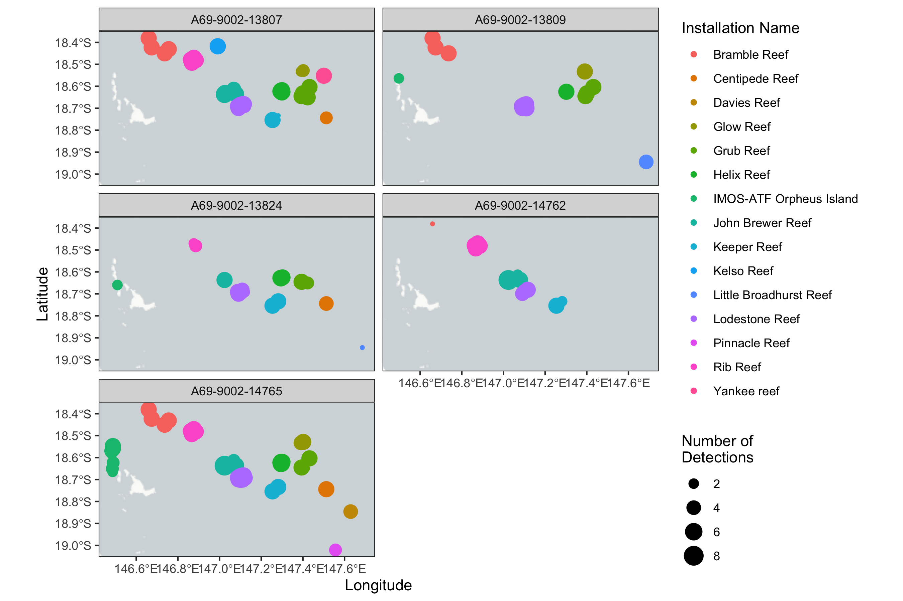
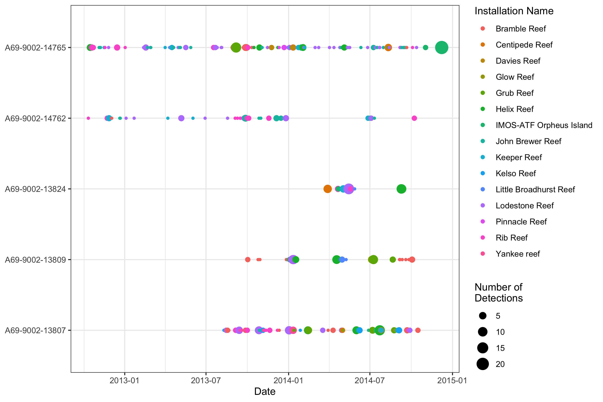
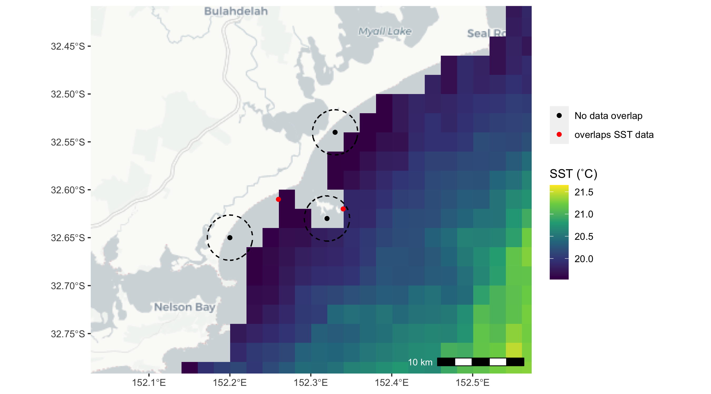
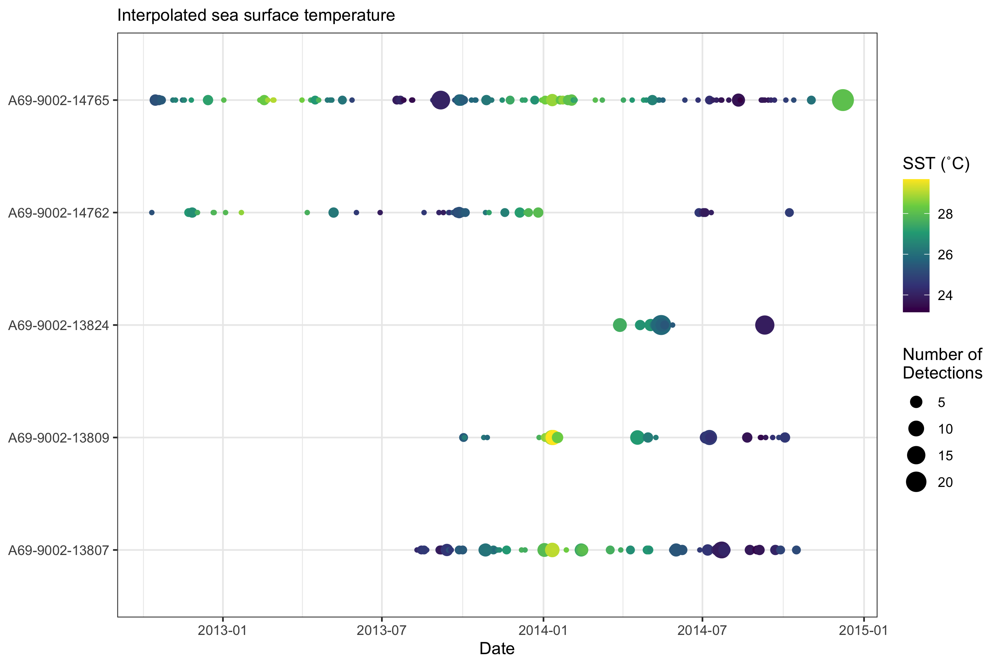
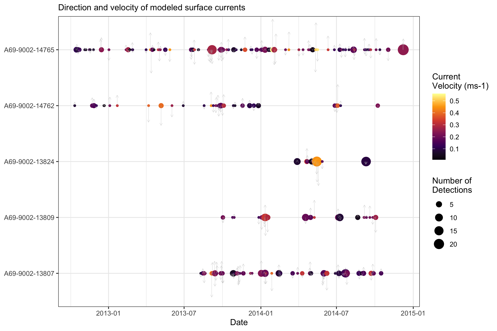
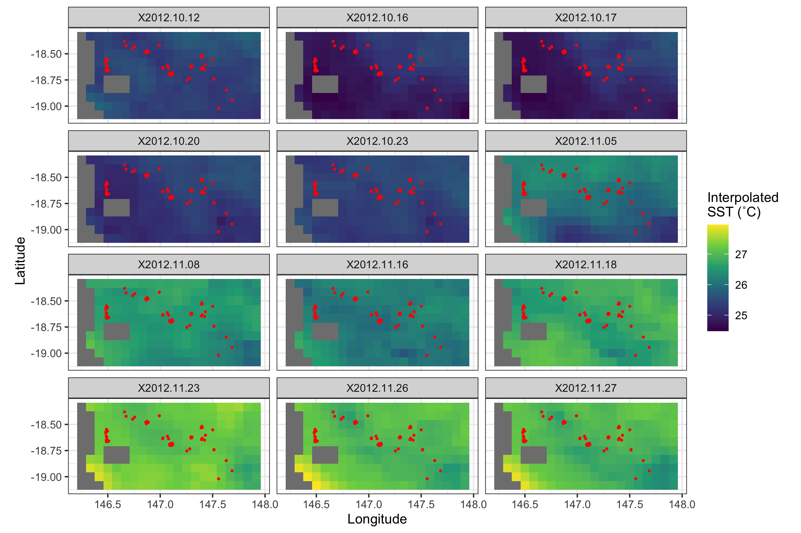

```{r, echo=FALSE, message=FALSE, warning=FALSE}
## working when developing vignette
require(tidyverse, quietly = TRUE)
require(remora, quietly = TRUE)

## load extracted dataset for faster running of vignette
data("env_extract_output", envir = environment())
```

--------------------------------------

Another key functionality of the `remora` package allows users to integrate acoustic telemetry data and environmental and habitat information. This package allows the user to match a range of environmental variables to each detection. Associating environmental data to detections provides a means to analyse environmental or habitat drivers of occurrence, presence and movement of animal monitored using acoustic telemetry. We advocate for users to first undertake a quality control step using the `tag_qc()` function and workflow before further analysis, however the functionality to append environmental data will work on any dataset that has at the minimum spatial coordinates and a timestamp for each detection event. 

Currently, the focus of this package is to integrate animal telemetry data and environmental data collated by Australia's [Integrated Marine Observing System](https://imos.org.au). Therefore, the geographical scope of available datasets is currently restricted to the Australiasia region. As this package develops, more sources of environmental data will be added to enable users to access more datasets across Australia and globally.

<br>

# Types of environmental data

This package allows users to access a range of ocean observing datasets that have undergone a quality control process and housed within the [Integrated Marine Observing System](https://imos.org.au). These datasets can also be explored through the [Australian Ocean Data Network portal](https://portal.aodn.org.au). There are primarily two types of environmental data that users can currently access:

*1. Remotely-sensed or gridded environmental data*

*2. In situ sub-surface environmental data from moorings at fixed locations*

<br>

The `imos_variables()` function will help the user identify currently available environmental layers that can be accessed and associated. Variables include spatial layers including `bathy` and `dist_to_land`, which provide distance measures of bathymetry (in meters) and proximity to land (in kilometers). Variable names that start with `rs_` are remotely-sensed or gridded environmental layers, and variables starting with `moor_` include *in situ* sub-surface mooring environmental layers.


```{r, warning=FALSE}
library(remora)

imos_variables()
```

<br>

In this vignette we will explore accessing and integrating gridded data. A suite of additional functions can be used to access and extract *in situ* sub-surface data from moorings (see `mooringTable()`; [link to Ross and Kylies vignette]()).


<br>

# Usage of the `extractEnv()` function

## Load example dataset

The primary function to extract and append remote sensing data to acoustic detection data is the `extractEnv()` function.
Lets start with a dataset that has undergone quality control (see `runQC()`; [link to Ians vignette]()).

```{r, eval = FALSE, message=FALSE, warning=FALSE}
library(tidyverse)
library(raster)
library(ggspatial)

## Example dataset that has undergone quality control using the `runQC()` function
data("TownsvilleReefQC")

## Only retain detections flagged as 'valid' and 'likely valid' (Detection_QC 1 and 2)
qc_data <- 
  TR_qc %>% 
  tidyr::unnest(cols = QC) %>%
  dplyr::ungroup() %>% 
  filter(Detection_QC %in% c(1,2))

```

<br>

Lets have a quick look at the spatial patterns in detection data:

```{r, eval=FALSE, message=FALSE, warning=FALSE, fig.align='center'}

qc_data %>% 
  group_by(transmitter_id, station_name, installation_name, receiver_deployment_longitude, receiver_deployment_latitude) %>% 
  summarise(num_det = n()) %>% 
  ggplot() +
  annotation_map_tile('cartolight') +
  geom_spatial_point(aes(x = receiver_deployment_longitude, y = receiver_deployment_latitude, 
                         size = num_det, color = installation_name), crs = 4326) +
  facet_wrap(~transmitter_id, ncol = 2) +
  labs(x = "Longitude", y = "Latitude", color = "Installation Name" , size = "Number of\nDetections") +
  theme_bw()

```



<br>

We can also have a look at the temporal pattern in detections:

```{r, eval=FALSE, message=FALSE, warning=FALSE, fig.align='center'}

qc_data %>% 
  mutate(date = as.Date(detection_datetime)) %>% 
  group_by(transmitter_id, date, installation_name) %>% 
  summarise(num_det = n()) %>% 
  ggplot(aes(x = date, y = transmitter_id, color = installation_name, size = num_det)) +
  labs(x = "Date", y = NULL, color = "Installation Name", size = "Number of\nDetections") +
  geom_point() +
  theme_bw()

```



<br>

## Environmental data extraction

In this example, we will extract two variables; *Interpolated sea surface temperature* and *modeled ocean surface currents*.

Each variable will need to be accessed one at a time using the `extractEnv()` function. There are a few parameters within the function that can help the user identify the variable required, and to manage the downloaded environmental layers:

+ **df**: the data frame with the detection data
+ **X**: the name of the column with longitude for each detection
+ **Y**: the name of the column with latitude for each detection
+ **datetime**: the name of the column with the date-timestamp for each detection
+ **env_var**: the name of the environmental variable to download and append (see `imos_variables()` for available variables and variable names)
+ **cache_layers**: should the extracted environmental data layers be cached within the working directory? If so, spatial layers will be cached within a folder called `imos.cache` within your working directory.
+ **crop_layers**: should the extracted environmental data be cropped to within the study site? reduces the file size of downloaded files
+ **full_timeperiod**: should environmental variables extracted for each day across full monitoring period, if set to `TRUE` it can be time and memory consuming for long projects
+ **folder_name**: name of folder within `imos.cache` where downloaded rasters should be saved. If none provided automatic folder names generated based on study extent
+ **.parallel**: should the function be run in parallel? speeds up environmental extraction for large datasets 

<br>

#### *Gap filling functionality*

Remote sensed environmental data within coastal areas (where acoustic arrays are often deployed) are often unreliable due to shallow habitats and close proximity to turbid nearshore waters. The quality control process for Ocean colour variables within the IMOS dataset often remove pixels in close proximity to coastlines due to the low quality of environmental variables in these regions. Here is an example where coastal remote sensing data may not match up with positions of deployed acoustic arrays. 




In these cases, a simple extraction will result in `NA`s where no overlap occurs (e.g., black points in the figure above). To maximise the understanding of environmental variables in the region of coastal arrays, `extractEnv()` provides the functionality to fill gaps in the extraction data using the `fill_gaps` parameter. If `fill_gaps = TRUE`, the function will extract the median variable values within a buffer around points that do not overlap data pixels (broken buffers around black points in the figure above). The radius of the buffer around the points that do not overlap data can be user defined (in meters) using the additional `buffer` parameter. If no `buffer` value is provided by the user, the function will automatically choose a buffer radius based on the resolution of environmental layer [5 km for `rs_sst`, `rs_chl`, `rs_npp`, `rs_turbidity`; 15 km for `rs_sst_interpolated`; 20 km for `rs_current` and `rs_salinity`].


<br>


#### *Interpolated sea surface temperature*

```{r, eval=FALSE, message=TRUE, warning=FALSE}

data_with_sst <- 
  extractEnv(df = qc_data,
             X = "receiver_deployment_longitude", 
             Y = "receiver_deployment_latitude", 
             datetime = "detection_datetime", 
             env_var = "rs_sst_interpolated",  ## Currently only a single variable can be called at a time
             cache_layers = TRUE,
             crop_layers = TRUE,
             fill_gaps = TRUE,
             full_timeperiod = FALSE,
             folder_name = "test",
             .parallel = TRUE)

```

<br>

#### *Modeled ocean surface currents*

We can now also append current data to this dataset:

```{r, eval=FALSE, message=TRUE, warning=FALSE}

data_with_sst_and_current <- 
  data_with_sst %>% 
  extractEnv(X = "receiver_deployment_longitude", 
             Y = "receiver_deployment_latitude", 
             datetime = "detection_datetime", 
             env_var = "rs_current", 
             cache_layers = TRUE,
             crop_layers = TRUE,
             fill_gaps = TRUE,
             full_timeperiod = FALSE,
             folder_name = "test",
             .parallel = TRUE)

```


<br>

As we set `cache_layers` to `TRUE`, the downloaded layers will be cached within the `imos.cache` folder within the working directory. Each time the function is called, downloaded layers are cached into this folder. We have also set the function to save the raster layers as the default .grd format within a subfolder called `test`.

When downloading current data, three variables are downloaded: Gridded Sea Level Anomaly (`rs_gsla`), surface geostrophic velocity in the north-south direction (`rs_vcur`) and the east-west direction (`rs_ucur`). These variables are used to calculate current velocity and bearing and appended to detections

<br>

## Examining the appended environmental data

We can now see the extracted environmental variables are appended as new columns to the input dataset

```{r, warning=FALSE, message=FALSE}
data_with_sst_and_current
```


We can also now add the variables to the detection plots:

```{r, eval = FALSE, message=FALSE, warning=FALSE}

summarised_data <-
  data_with_sst_and_current %>% 
  mutate(date = as.Date(detection_datetime)) %>% 
  group_by(transmitter_id, date) %>% 
  summarise(num_det = n(),
            mean_sst = mean(rs_sst_interpolated, na.rm = T),
            mean_current_velocity = mean(rs_current_velocity, na.rm = T),
            mean_current_bearing = mean(rs_current_bearing, na.rm = T))

ggplot(summarised_data, aes(x = date, y = transmitter_id, size = num_det, color = mean_sst)) +
  geom_point() +
  scale_color_viridis_c() +
  labs(subtitle = "Interpolated sea surface temperature", x = "Date", 
       y = NULL, color = "SST (˚C)", size = "Number of\nDetections") +
  theme_bw()

``` 



```{r, eval=FALSE, message=FALSE, warning=FALSE}

ggplot(summarised_data) +
  geom_point(aes(x = date, y = transmitter_id, color = mean_current_velocity,
                 size = num_det)) +
  geom_spoke(aes(x = date, y = transmitter_id, angle = mean_current_bearing, radius = mean_current_velocity),
             arrow = arrow(length = unit(0.05, 'inches')), color = "grey", lwd = 0.1) +
  labs(subtitle = "Direction and velocity of modeled surface currents", x = "Date", 
       y = NULL, color = "Current\nVelocity (ms-1)", size = "Number of\nDetections") +
  scale_color_viridis_c(option = "B") +
  theme_bw()

```



<br>
<br>


If the environmental layers were cached, we can also look at how the variables altered spatially:

```{r, eval=FALSE, message=FALSE, warning=FALSE}

## Detection data summary
det_summary <-
  qc_data %>% 
  group_by(station_name, lon = receiver_deployment_longitude, lat = receiver_deployment_latitude) %>% 
  summarise()

## Sea surface temperature
sst_raster <- stack("imos.cache/rs variables/test/rs_sst_interpolated.grd")

sst_df <- 
  as.data.frame(sst_raster[[1:12]], xy = T) %>% 
  pivot_longer(-c(1,2))

ggplot(sst_df) +
  geom_tile(aes(x, y, fill = value)) +
  scale_fill_viridis_c() +
  geom_point(data = det_summary, aes(x = lon, y = lat), size = 0.5, color = "red", inherit.aes = F) +
  labs(fill = "Interpolated\nSST (˚C)", x = "Longitude", y = "Latitude") +
  coord_equal() +
  facet_wrap(~name, nrow = 4) +
  theme_bw()

```


<br>

Current data can be plotted using other very useful libraries like the [`metR`](https://github.com/eliocamp/metR) package.

```{r, eval=FALSE, message=FALSE, warning=FALSE}
## Current
library(metR)
library(sf)

## read in vcur and ucur spatial data
vcur_raster <- stack("imos.cache/rs variables/test/rs_vcur.grd")[[1:4]]
vcur_raster[is.na(values(vcur_raster))] <- 0
ucur_raster <- stack("imos.cache/rs variables/test/rs_ucur.grd")[[1:4]]
ucur_raster[is.na(values(ucur_raster))] <- 0

## calculate velocity (ms-1)
vel_raster <- sqrt(vcur_raster^2 + ucur_raster^2)

## extract values from raster stacks
uv <-
  as.data.frame(vcur_raster, xy = T) %>%
  pivot_longer(-c(1,2), names_to = "date", values_to = "v") %>% 
  left_join(as.data.frame(ucur_raster, xy = T) %>%
              pivot_longer(-c(1,2), names_to = "date", values_to = "u")) %>%
  left_join(as.data.frame(vel_raster, xy = T) %>%
              pivot_longer(-c(1,2), names_to = "date", values_to = "vel")) %>% 
  mutate(date = str_replace_all(str_sub(date, start = 2, end = 11), pattern = "[.]", replacement = "-"))

ggplot() +
  geom_contour_fill(data = uv, aes(x = x, y = y, z = vel, fill = stat(level)),
                    binwidth = 0.05, alpha = 0.7, inherit.aes = F) +
  geom_streamline(data = uv, skip = 0, size = 0.05, L = 1, res = 5, jitter = 5, lineend = "round",
                  aes(x = x, y = y, dx = u, dy = v), color = "white") +
  scale_fill_viridis_d(option = "B", name = "Current Velocity (m/s)") +
  geom_point(data = det_summary, aes(x = lon, y = lat), size = 0.5, color = "red", inherit.aes = F) +
  facet_wrap(~ date, nrow = 2) +
  labs(subtitle = "Modeled surface currents", x = "Longitude", y = "Latitude") +
  theme_bw()

```


<br>

---------------------------------------

**Vignette version**
0.0.3 (10 Oct 2021)


<div class="tocify-extend-page" data-unique="tocify-extend-page" style="height: 0;"></div>


