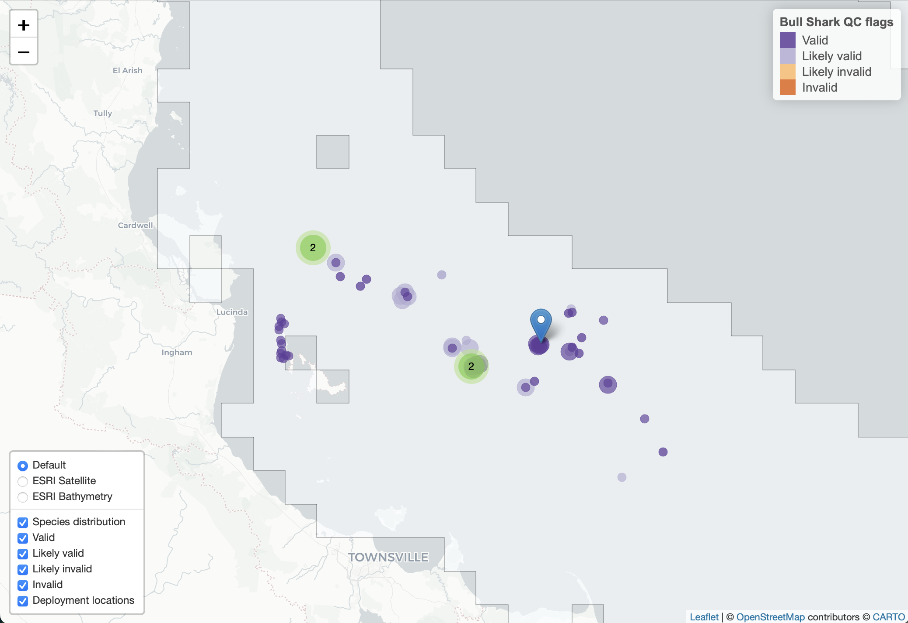

```{r, echo=FALSE, message=FALSE, warning=FALSE}
## working when developing vignette
require(tidyverse, quietly = TRUE)
require(remora, quietly = TRUE)
```

--------------------------------------

The typical entry point to the `remora` package will be to apply quality control (QC) processes to acoustic detections data downloaded via the [IMOS AODN WebApp](https://animaltracking.aodn.org.au). The `remora` package uses the QC process described in [Hoenner et al. (2018)](https://www.nature.com/articles/sdata2017206) with necessary modifications to accommodate the WebApp data and metadata formats. The QC workflow has been made as simple as possible, given the constraint of manually downloading the data and metadata prior to interaction with `remora`. This vignette describes the QC workflow. 


# Required data

Typically, users will download four `.csv` files via the WebApp interface:

*1. Tag detections data*

*2. Transmitter deployment metadata*

*3. Receiver deployment metadata*

*4. Animal measurements data*

<br>

Users will tell `remora` where to find these files by creating a `files` list as follows:

```{r files 1, eval=FALSE}
files <- list(det = "path_to/IMOS_detections.csv",
              rmeta = "path_to/IMOS_receiver_deployment_metadata.csv",
              tmeta = "path_to/IMOS_transmitter_deployment_metadata.csv",
              meas = "path_to/IMOS_animal_measurements.csv")
```

The detections data, receiver and transmitter metadata files are required to enable the full QC process, however because of some redundancy in variables among the detections data and metadata files, a partial QC can be conducted when one or both metadata files are missing. In these latter cases, the path for a missing metadata file is set to `rmeta = NULL` and/or `tmeta = NULL`; a warning will be issued when the QC is run. Similarly, if no animal measurements data are present the path is set to `meas = NULL`. The presence or absence of this latter file does not affect the QC process.

# Usage of the `runQC()` function

The primary function for conducting the QC is `runQC()` function. Let's start with an example tracking project included in the `remora` package by first creating a `files` list:

```{r files 2, warning=FALSE}
files <- list(det = system.file(file.path("test_data","IMOS_detections.csv"), package = "remora"),
              rmeta = system.file(file.path("test_data","IMOS_receiver_deployment_metadata.csv"),
                    package = "remora"),
              tmeta = system.file(file.path("test_data","IMOS_transmitter_deployment_metadata.csv"),
                    package = "remora"),
              meas = system.file(file.path("test_data","IMOS_animal_measurements.csv"),
                    package = "remora"))
```

<br>

We invoke the QC using `runQC()`:

```{r runQC, eval = FALSE, message=FALSE}
tag_qc <- runQC(files, logfile = "R/QC_log.txt", .parallel = TRUE, .progress = FALSE)
```

where the argument `logfile = "R/QC_log.txt"` specifies the path and name of the QC logfile that records issues found in the data and/or metadata during the QC process. By default, the QC logfile is saved to the working directory. Entries in the logfile provide some indication of a problem that the user may wish to explore and follow up as appropriate. Simple issues, such as detection or receiver deployment latitudes in the northern hemisphere, are resolved automatically and corrected in the QC'd data output. The `.parallel = TRUE` argument runs the QC in parallel across the available number of processor cores - 2. This can be modified using the `.ncores` argument. If `.parallel = FALSE` then the QC is run sequentially, which can take considerable time but may be more efficient for projects with a small number of transmitters. The `.progress = FALSE` argument turns off the QC progress indicator, it is set to `TRUE` (turned on) by default but set to `FALSE` here to keep the vignette tidy.  

<br>

## Accessing the QC'd data and metadata

The QC output object `tag_qc` is a nested tibble with each row corresponding to an individual animal using the `transmitter_id`, `tag_id` and `tag_deployment_id` as a unique identifier:

```{r QC output, echo = FALSE}
load("R/tag_qc.rda")
tag_qc
```

The `QC` list variable contains the QC'd detections data and metadata for each individual deployment. The utility function `grabQC()` provides a simple method to extract manageable segments of the QC output for subsequent review and analysis. For example, we can grab only the basic detection data with the QC flags and then filter the detections to retain only those flagged as 'valid' or 'likely valid':

```{r grab dQC, message=FALSE}
dQC <- grabQC(tag_qc, what = "dQC") %>%
  filter(Detection_QC %in% 1:2)

dQC
```

The `dQC` object can form the basis for subsequent annotation with environmental data (see `extractENV()`; [extractENV-vignette](remora_extractENV.html); and `extractMoor()`; [extractMoor-vignette](remora_extractMoor.html)) and analysis.  

The metadata and animal measurements associated with QC'd detections can also be extracted in a compact form (without duplication of records):

```{r grab meta, message=FALSE}
tag_meta <- grabQC(tag_qc, what = "tag_meta")
rec_meta <- grabQC(tag_qc, what = "rec_meta")
meas <- grabQC(tag_qc, what = "meas")
```

If a user wishes to work with a simple data.frame containing all the QC output then the nested tibble can be converted using `tidyr::unnest()` and `dplyr::ungroup()` as follows:

```{r unnest tag_qc, message=FALSE}
qc <- tag_qc %>%
  tidyr::unnest(cols = QC) %>%
  dplyr::ungroup()

qc
```

<br>

## Visualising the QC'd detections

The QC'd detections can be visualised as a map using the `plotQC()` function, which produces a `.png` file for each species present in the data. By default the file(s) is/are named with the species' common name(s) and are written to the working directory. The file(s) can be saved elsewhere by using the `path` argument:

```{r plotQC, message=FALSE, warning=FALSE, fig.align='center'}
plotQC(tag_qc, path = "images")
```
