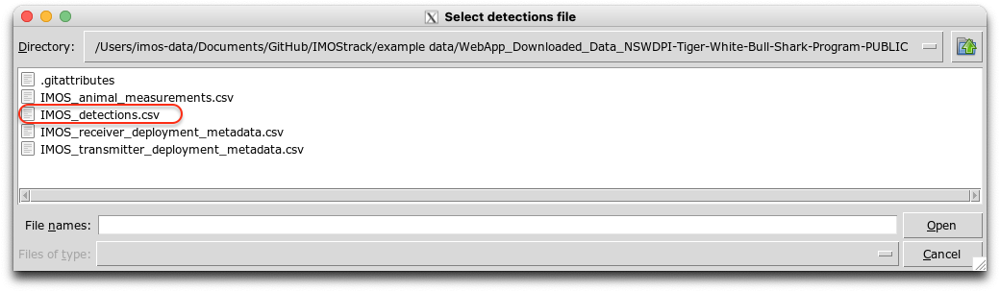
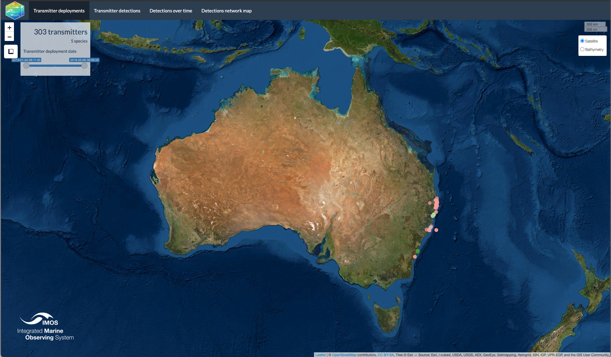
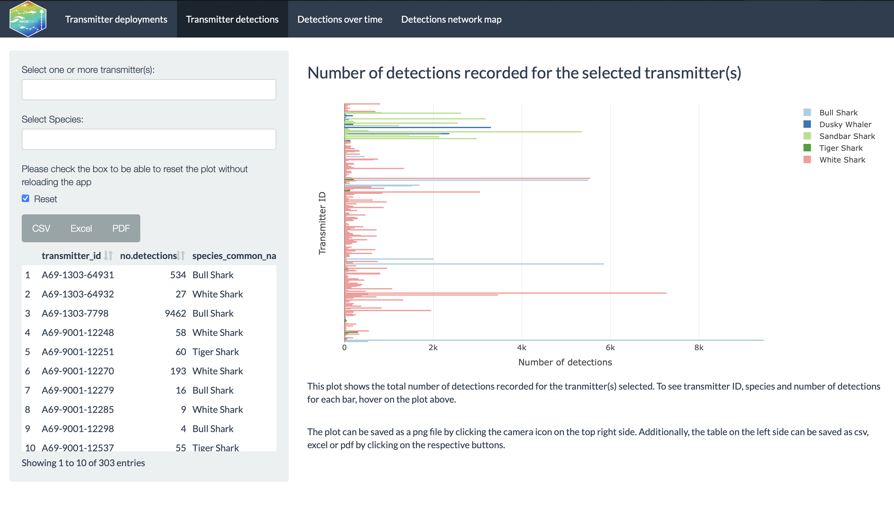
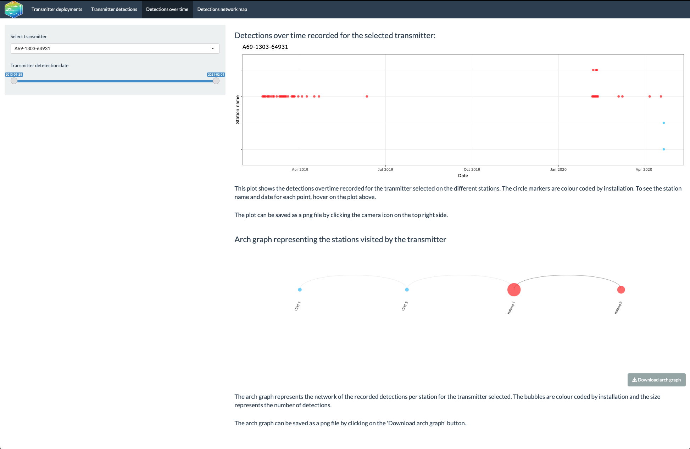
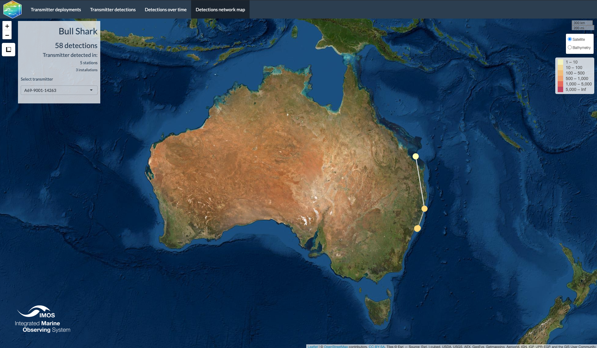

--------------------------------------

The `remora` package includes basic statistics and visualisations for a **transmitter** or **receiver array** project. The `shinyReport()` function allows users to create an interactive report of their projects, having different visualisation and analytical tools. All the plots and tables provided can be downloaded so the user can perform further analysis of the data. This report is mainly an exploratory analysis and shouldn't be considered as an extensive statistical analysis. Currently, the focus of this package is to integrate animal telemetry data and environmental data housed within the [Integrated Marine Observing System](https://imos.org.au), and therefore primarily focuses within Australia. 
<br>

---------------------------------------

# Transmitter report


<br>

The transmitter report provides users with basic statistics and visualisation of the detections for their tagging project. The report is in a shiny app format which will be open in the default browser. 

<br>


## Install packages and run shiny app
<br>
The `remora` package should be installed to be able to call the functions. The `shinyReport()` function requires the type of project to retrieve the respective report (i.e. receiver array or transmitter project).

```{r, eval=FALSE}
install.packages("remora")
shinyReport("transmitter")
```
<br>
The function will generate a pop-up window of the folder navigator where users can select their detections file from a trasnmitter project. The detections file is assumed to be downloaded from the [Australian Animal Acoustic Telemetry Database](https://animaltracking.aodn.org.au/projects).




## Transmitter deployments

<br>

The first tab of the report corresponds to the location where the transmitters were deployed. The transmitters are colour coded by species and when hovering on the points additional information appears (coordinates, station name, number of detections). 

This map is interactive and allows the user to filter by the dates of the transmitter deployment.

<br>




## Transmitter detections

<br>

In the second tab of the transmitter report, users can find the total number of detections per transmitter. The detections are represented in a horizontal bar plot that is colour coded by species. This plot is interactive and allows users to select by transmitters and/or species. When hovering on the bars there is additional information for each tranmitter id (species common name, number of detections, station name, transmitter id). The plot can be downloaded as a png file by clicking on the camera icon on the top right side opf the plot.

On the left side, the users can filter the plot by transmitters and/or species. Above the filters, users can view a table with the transmitter ID, number of detections per transmitter and species common name. The table can be downloaded as csv, excel or pdf file.

Since the interactivity is still a work in progress, users need to select the "Reset" checkbox to be able to reset the plot when no transmitters or species are selected.


<br>





## Detections over time

<br>

The detections over time tab, includes an abacus plot of the detections for the selected transmitter and an arch graph of the detections per station, both colour coded by installation. When hovering on the abacus plot, additional information is shown (transmitter ID, detection date and number of detections per day). The arch graph represents the station network and the size of the bubble shows the number of detections per station.

Users can filter both graphs by transmitter and/or date. If the date is out of range a warning message will appear. 

The abacus plot can be saved as a png file by clicking on the camera icon located at the top right of the plot. The arch graph can be saved as a png file by clicking on the "Download arch graph" button.

<br>




## Detections network map 
<br>

The detections network map contains a leaflet map with the detections network for the transmitter selected. Each bubble represents the station at which the transmitter was detected and they are colour coded by number of detections (see legend on the right side of the map). The left panel shows the species common name, the total number of detections, stations and installations. **The user has to select a transmitter for the map to show the network.** 

Note that the map takes more time to load when the transmitter had higher number of detections.

<br>



<br>


--------------------------------------

#Receiver array report

**Vignette version**
0.0.1 (06 Jul 2021)


<div class="tocify-extend-page" data-unique="tocify-extend-page" style="height: 0;"></div>


