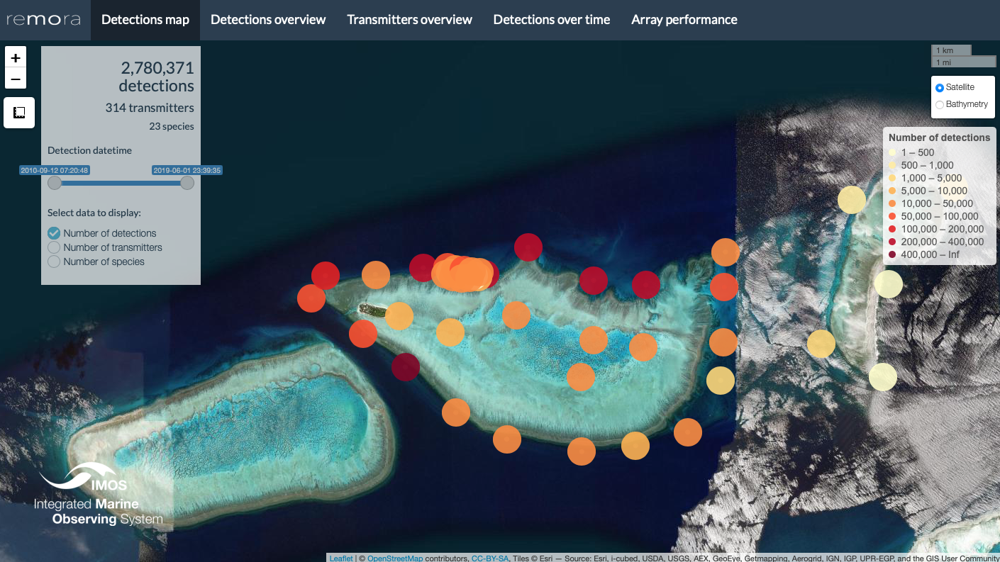
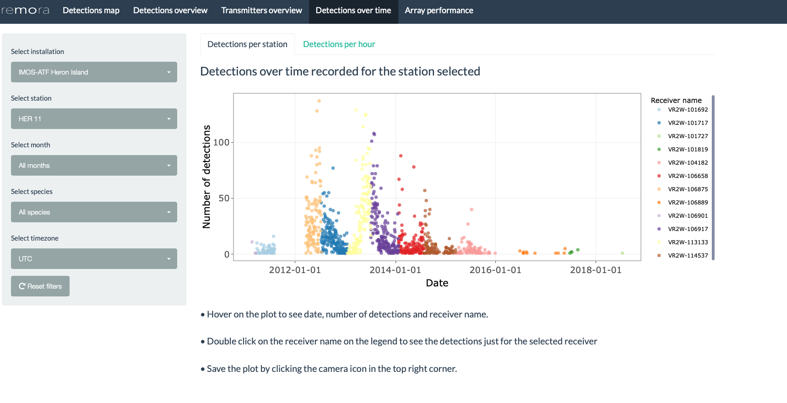
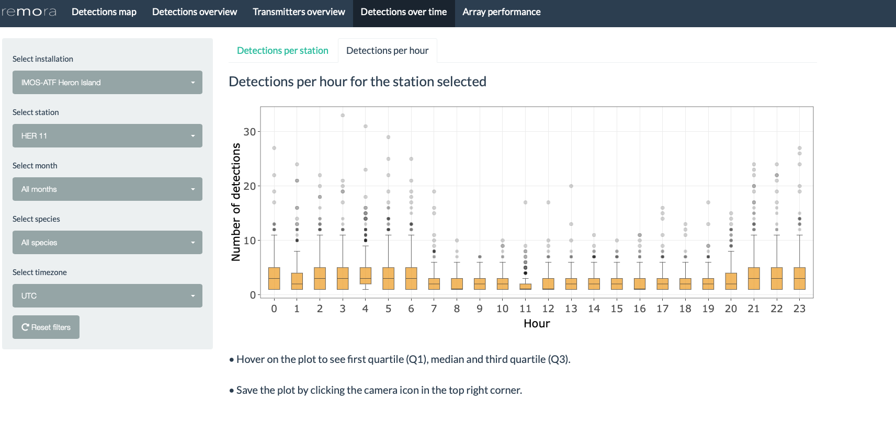
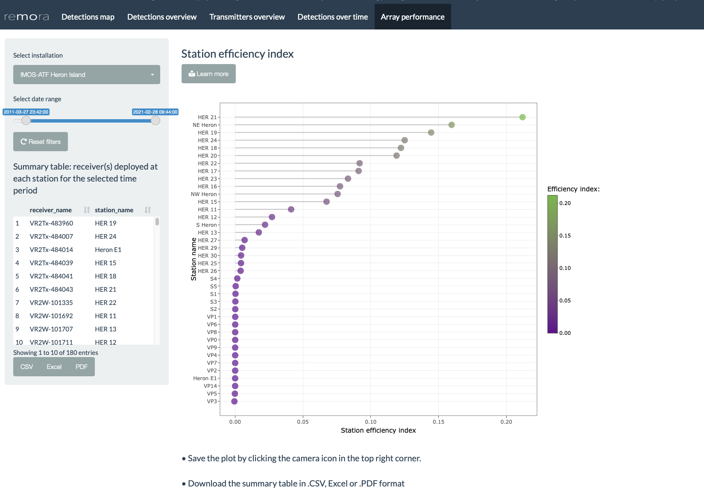

--------------------------------------

The `remora` package includes statistics and visualisations for a **tagging** or **receiver array** project. The `shinyReport()` function allows users to create an interactive report of their projects, having different visualisation and analytical tools. All the plots and tables provided can be downloaded so the user can perform further analysis of the data. This report is an exploratory analysis and should not be considered as an extensive analysis. Currently, the focus of this package is to integrate animal telemetry data and environmental data housed within the [Integrated Marine Observing System](https://imos.org.au), and therefore primarily focuses within Australia. 
<br>

---------------------------------------


# Receiver Array Report

The receiver array report provides users with basic statistics and visualisations for their receiver array project. The function produces a Shiny App that will open in the user's default browser.


## Run Shiny App

The `remora` package should be installed to be able to call the functions.

The `shinyReport()` function requires the type of project to retrieve the respective report (i.e. receiver array or transmitter project).

```{r, eval=FALSE}
remotes::install_github("IMOS-AnimalTracking/remora")
shinyReport("receiver")
```
<br>

The function will generate a pop-up window where the user can navigate through the folders and select the detections file from a receiver array project. Once this file is loaded, another pop-up window will appear asking for the receiver deployment metadata file. These files can be accessed from the [Australian Animal Acoustic Telemetry Database](https://animaltracking.aodn.org.au/projects) or the user can select their own data, previously formatted to match the database.

In this vignette, data from the Heron Island project will be displayed (Jaine et al., 2021).


## Detections map
<br>

Map of the detections recorded by each station in the array. The user can select different displays to show the number of detections, number of transmitters or number of species. Additionally, the date range can be modified with the slider on the left panel. When hovering on the bubbles a pop-up text appears with the station name, installation name, number of detections, number of species, number of transmitters and the coordinates of the station.

<br>



## Detections overview
<br>
Bar plot of the number of detections per station colour coded by the different species detected in the array. The user can filter by station and/or species.

When hovering on the bars additional information appears with the station name, species common name and number of detections. The plot can be saved by clicking on the camera icon at the top right corner.

The summary table on the left panel shows the station name, species common name and number of detections. When the user selects different filters the summary table will be modified. This table can be saved as .CSV, Excel or PDF by clicking on the respective buttons.

<br>


## Transmitters overview
<br>
Bar plot of the number of transmitters per station colour coded by the different species detected in the array. The user can filter by station and/or species.

When hovering on the bars additional information appears with the station name, species common name and number of transmitters. The plot can be saved by clicking on the camera icon at the top right corner.

The summary table on the left panel shows the station name, species common name and number of transmitters. When the user selects different filters the summary table will be modified accordingly. This table can be saved as .CSV, Excel or PDF by clicking on the respective buttons.

<br>


## Detections over time

### Detections per station
<br>
Scatter plot of the number of detections per day colour coded by receiver. The user can filter by installation, station, month and/or species. Additionally, the user can select a different timezone (default timezone is UTC; <span style="color: red;"> WARNING modifying the timezone will require a long time to load</span>).

When hovering on the points additional information appears with the date, number of detections and receiver name. The plot can be saved by clicking on the camera icon at the top right corner.

<br>


### Detections per hour
<br>
Box plot of the number of detections per hour. The user can filter by installation, station, month and/or species. Additionally, the user can select a different timezone (default timezone is UTC; <span style="color: red;"> WARNING modifying the timezone will require a long time to load</span>).

When hovering on the plot additional information appears with the maximum value, upper fence, Q3, median and Q1. The plot can be saved by clicking on the camera icon at the top right corner.

<br>


## Array performance
<br>

Plot of the station efficiency index, modified from [Ellis et al. (2019)](https://doi.org/10.1016/j.fishres.2018.09.015), measures the performance of the station compared to the whole array. Values range from 0 to 1, higher values indicate higher performance. The user can filter by installation and date range (i.e. days where the station was active).

When hovering on the plot additional information appears with the value of the index for each station. The plot can be saved by clicking on the camera icon at the top right corner.

The summary table on the left panel shows the receiver name and station name for the installation and date range selected. This table can be saved as .CSV, Excel or PDF by clicking on the respective buttons.

<br>




*Note: To explore and visualise a Tagging project head to [remora_shinyReport_transmitters vignette](remora_shinyReport_transmitters.html)*

## References
1. Ellis, R.D., Flaherty-Walia, K.E., Collins, A.B., Bickford, J.W., Boucek, R., Walters Burnsed S.L., Lowerre-Barbieri, S.K. (2019) Acoustic telemetry array evolution: From species- and project-specific designs to large-scale, multispecies, cooperative networks. Fisheries Research (209): 186-195. https://doi.org/10.1016/j.fishres.2018.09.015

2. Jaine, F.R.A., et al. (2021) IMOS-ATF Heron Island. IMOS Animal Tracking Facility. (Available: Integrated Marine Observing System. Animal Tracking Database. https://animaltracking.aodn.org.au. Accessed: 2021-10-11).

3. IMOS 2021. Animal Tracking Database. https://animaltracking.aodn.org.au. Accessed: 2021-10-11.

<br>

**Vignette version**
0.0.3 (11 Oct 2021)


<div class="tocify-extend-page" data-unique="tocify-extend-page" style="height: 0;"></div>


