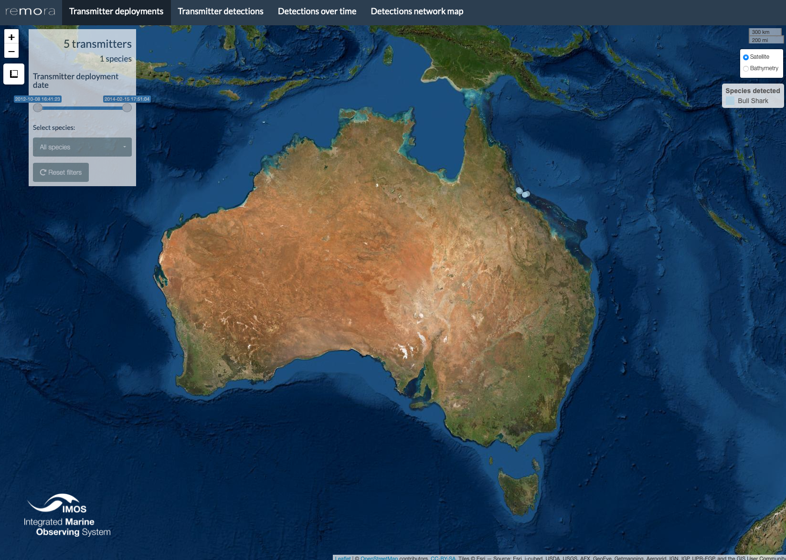
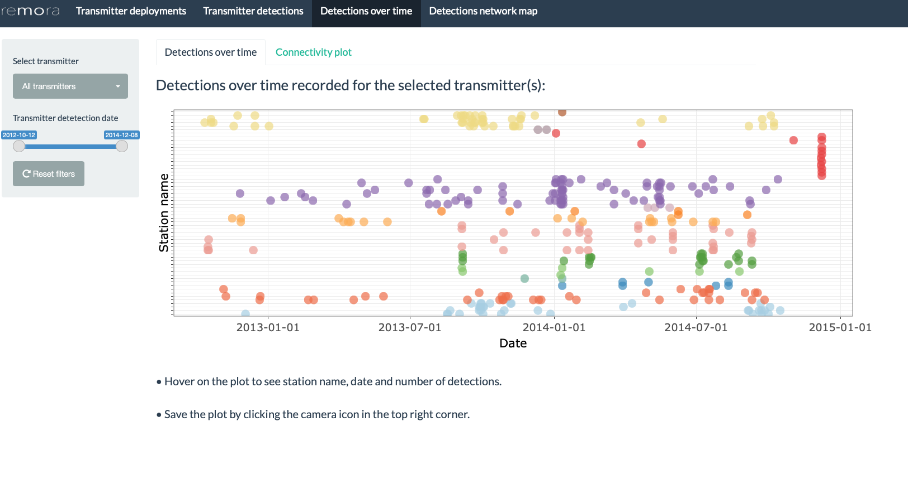
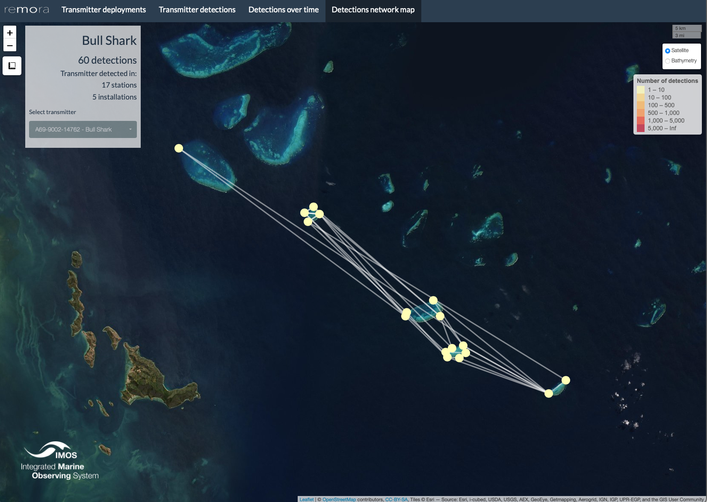

--------------------------------------

The `remora` package includes statistics and data visualisations for acoustic telemetry **receiver array** and **tagging** projects. The `shinyReport()` function allows users to create an interactive data report for their projects, which comprises a range of visualisations and analytical tools to aid data exploration and project management. The resulting plots and tables  can be downloaded for further use and analysis. This interactive report is an exploratory tool and should not be considered an extensive analysis toolkit. 

Currently, the focus of the `remora` package is to integrate animal telemetry data and oceanographic observations collated by Australia's [Integrated Marine Observing System](https://imos.org.au). Therefore, the geographical scope of available datasets is currently restricted to the Australiasia region. 
<br>

---------------------------------------

# Tagging Project

The receiver array report provides users with basic summary statistics and data visualisations for their acoustic telemetry receiver array project. When called, the function produces an interactive Shiny App that will open in the user's default internet browser.


## Run Shiny App
<br>
The `remora` package should be installed prior to calling the functions described in this vignette.

The `shinyReport()` function requires the user to specify the type of report to produce. Two options are available depending on whether the user wishes to produce a report for their receiver array project (`receivers`) or tagging project (`transmitters`). 

This vignette describes the receiver array (`transmitters`) report.

```{r, eval=FALSE}
remotes::install_github("IMOS-AnimalTracking/remora")
shinyReport("transmitters")
```
<br>

The `shinyReport()` function will generate a pop-up window enabling the user to navigate and select the detections data .CSV file for the receiver array project of their choice. Once this file is loaded, another pop-up window will appear prompting the user to select the corresponding receiver deployment metadata file. These files can be accessed via the [IMOS Australian Animal Acoustic Telemetry Database](https://animaltracking.aodn.org.au/projects). Alternatively, the user can select their own data, previously formatted to match the IMOS database output format.

In this vignette, a sample dataset from the Townsville Reefs project (Heupel et al. 2021) archived in the [IMOS Australian Animal Acoustic Telemetry Database](https://animaltracking.aodn.org.au/projects) is presented.


## Transmitter deployments

<br>

Map showcasing the locations of transmitter deployments associated with the selected tagging project, colour-coded by species. The user can filter according to the species and/or date of the transmitter deployment.

Hovering on the markers will reveal additional information including the transmitter ID, species common name and deployment coordinates.


<br>




## Transmitter detections

<br>

Bar plot presenting the number of detections recorded per transmitter, colour-coded by species. The user can filter by transmitter ID and/or species. Hovering on the bars will reveal additional information including the species common name and number of detections recorded. The plot can be downloaded by clicking on the camera icon in the top right corner.

The table on the left panel summarises the number of detections per transmitter per species. This summary table can be downloaded as a .CSV, Excel or .PDF file by clicking on the respective buttons. 

<br>


## Detections over time

This tab comprises an interactive abacus plot as well as a connectivity plot allowing the exploration of transmitter detections through time. Users can filter both plots according to the transmitter ID(s) and date range of interest. A warning message will appear if the date is out of range.


### Abacus plot

<br>

Interactive plot of the detections over time for the selected transmitter(s), colour-coded according to the receiver installation they were detected at. Hovering on the plot will reveal additional information including the detection date and number of detections recorded for the selected transmitter.

The plot can be saved by clicking on the camera icon in the top right corner of the plot. 

<br>



### Connectivity plot

<br>

The connectivity plot represents movement connections recorded between receiver stations and installations visited by the selected transmitter(s). Colours identify separate installations in the dataset and line boldness highlights the importance of these movement paths within the dataset.

The plot can be saved by clicking on the "Download plot" button.

<br>


## Detections network map 
<br>

The detections network map features the connectivity paths between detections recorded for the selected transmitter. Each marker on the map represents the station at which the transmitter was detected, colour-coded by the number of detections recorded (see legend on the right side of the map). The left panel also presents the species common name, total number of detections as well as stations and installations that the transmitter was detected at. <span style="color: red;">The user has to select a transmitter in order for the map to show the network.</span> 

Note: the map may take more time to load depending on the number of detections for the selected transmitter.

<br>



<br>

*Note: To explore and visualise data relative to a receiver array project, head over to the [remora_shinyReport_receivers vignette](remora_shinyReport_receivers.html)*

## References

1. Heupel, M., Simpfendorfer, C., Espinoza, M., Bierwagen, S., de Faria, F., Lédée, E., Matley, J., Tobin, A. (2021) Townsville Reefs. Australian Institute of Marine Science and James Cook University. (Available: Integrated Marine Observing System. Animal Tracking Database. https://animaltracking.aodn.org.au. Accessed: 2021-10-11).

2. IMOS 2021. Animal Tracking Database. https://animaltracking.aodn.org.au. Accessed: 2021-10-11.

**Vignette version**
0.0.4 (13 Oct 2021)


<div class="tocify-extend-page" data-unique="tocify-extend-page" style="height: 0;"></div>


