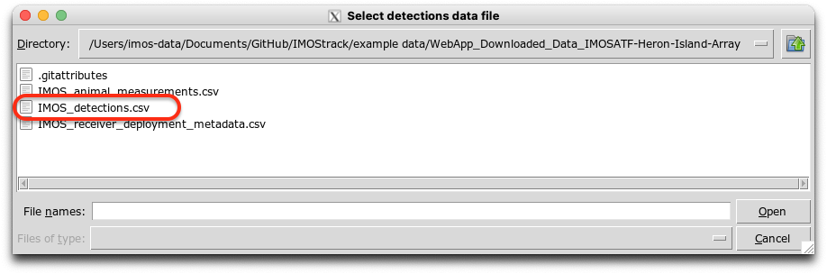
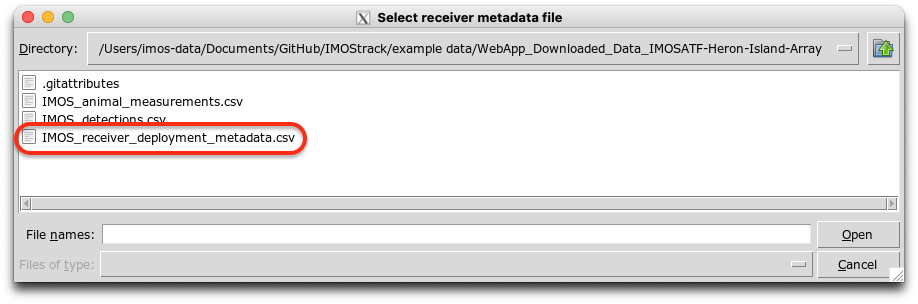
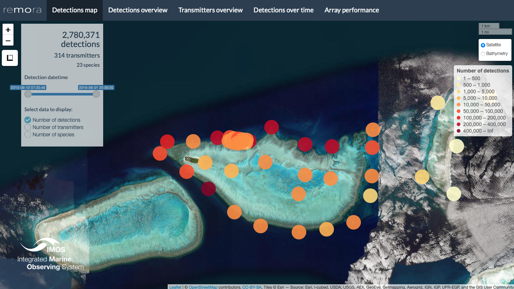
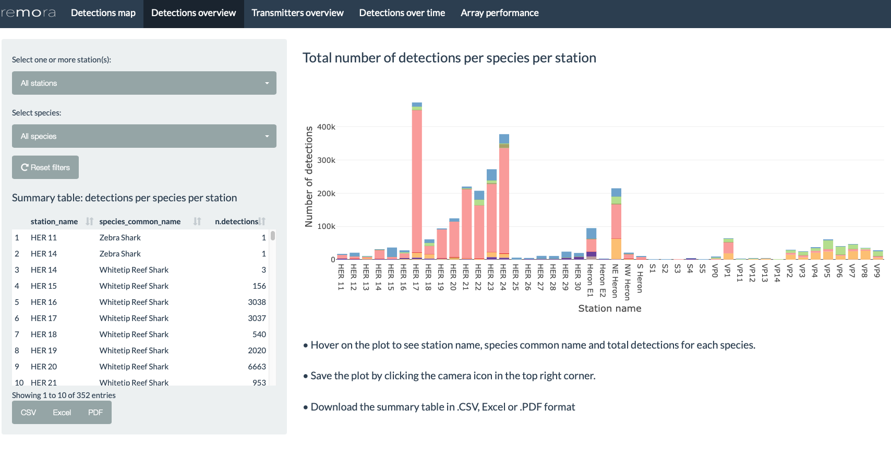
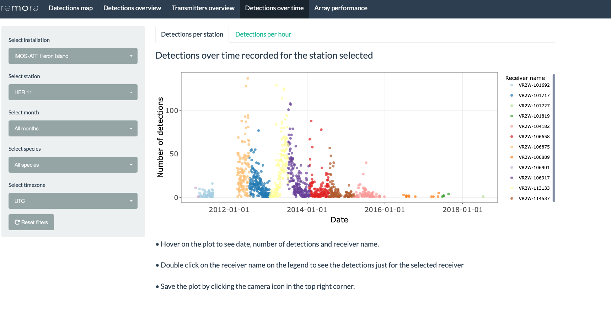
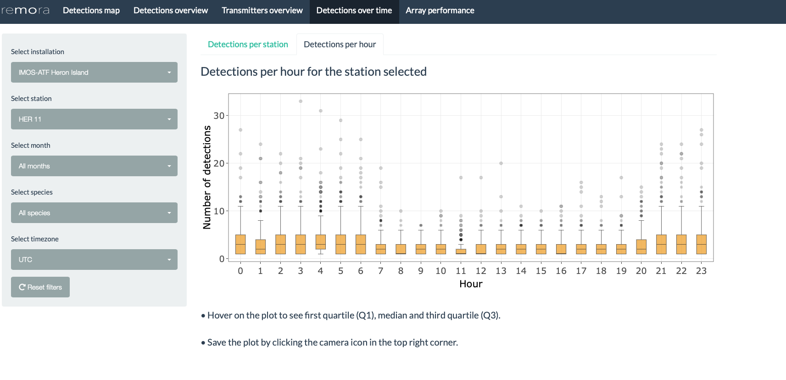

--------------------------------------

The `remora` package includes statistics and data visualisations for acoustic telemetry **receiver array** and **tagging** projects. The `shinyReport()` function allows users to create an interactive data report for their projects, which comprises a range of visualisations and analytical tools to aid data exploration and project management. The resulting plots and tables  can be downloaded for further use and analysis. This interactive report is an exploratory tool and should not be considered an extensive analysis toolkit. 

Currently, the focus of the `remora` package is to integrate animal telemetry data and oceanographic observations collated by Australia's [Integrated Marine Observing System](https://imos.org.au). Therefore, the geographical scope of available datasets is currently restricted to the Australiasia region. 
<br>

---------------------------------------


# Receiver Array Report

The receiver array report provides users with basic summary statistics and data visualisations for their acoustic telemetry receiver array project. When called, the function produces an interactive Shiny App that will open in the user's default internet browser.


## Run Shiny App

The `remora` package should be installed prior to calling the functions described in this vignette.

The `shinyReport()` function requires the user to specify the type of report to produce. Two options are available depending on whether the user wishes to produce a report for their receiver array project (`receivers`) or tagging project (`transmitters`). 

This vignette describes the receiver array (`receivers`) report.

```{r, eval=FALSE}
shinyReport("receivers")
```
<br>

The `shinyReport()` function will generate a pop-up window enabling the user to navigate and select the detections data .CSV file for the receiver array project of their choice. Once this file is loaded, another pop-up window will appear prompting the user to select the corresponding receiver deployment metadata file. These files can be accessed via the [IMOS Australian Animal Acoustic Telemetry Database](https://animaltracking.aodn.org.au/projects). Alternatively, the user can select their own data, previously formatted to match the IMOS database output format.

In this vignette, multi-year and multi-species data from the IMOS Heron Island receiver array project are presented as an example.






## Detections map
<br>
Map of the detections recorded at each station in the receiver array. The user can select different datasets to overlay on the map including the number of detections, transmitters or species detected. Additionally, the date range can be modified with the time slider on the left panel. Hovering on the markers reveals pop-up text including the station name, installation name, number of detections, number of species, number of transmitters and the coordinates of the receiver station.

<br>



## Detections overview
<br>
Bar plot presenting the number of detections recorded at each station, colour-coded according to the different species detected in the array. The user can filter by station and/or species to explore patterns in the data. Hovering on each bar will reveal additional information including the station name, species common name and number of detections recorded. 

The plot can be saved by clicking on the camera icon in the top right corner.

The summary table on the left panel summarises the number of detections per species per station within the receiver array. This summary table is refreshed as the user selects different filter options. This table can be saved as .CSV, Excel or .PDF file by clicking on the respective buttons.

<br>




## Transmitters overview
<br>
Bar plot presenting the number of transmitters detected at each receiver station, colour-coded by according to the different species detected in the array. The user can filter by station and/or species, as required. Hovering on each bar will reveal additional information including the station name, species common name and number of transmitters detected. 

The plot can be saved by clicking on the camera icon in the top right corner.

The summary table on the left panel summarises the number of transmitters detected per species at per station. When the user selects different filters the summary table will be modified accordingly. This table can be saved as .CSV, Excel or .PDF by clicking on the respective buttons.

<br>


## Detections over time

### Detections per station
<br>
Scatter plot presenting the number of detections per day recorded at a receiver station, colour-coded according to the receiver deployed. The user can filter by installation, station, month and/or species to explore patterns in the data. Additionally, the user can select a different timezone (default timezone is UTC; <span style="color: red;"> WARNING modifying the timezone may incur some delays to update the plot</span>).Hovering on the data points reveals additional information including the date, number of detections recorded and the receiver name. 

The plot can be saved by clicking on the camera icon in the top right corner.

<br>


### Detections per hour
<br>
Box plot presenting the number of detections recorded per hour. The user can filter by installation, station, month and/or species. Additionally, the user can select a different timezone (default timezone is UTC; <span style="color: red;"> WARNING modifying the timezone may incur some delays to update the plot</span>).Hovering on the plot will reveal additional information including the maximum value, upper fence, Q3, median and Q1. 

The plot can be saved by clicking on the camera icon in the top right corner.

<br>


## Array performance
<br>

Plot of the Station Efficiency Index, modified from [Ellis et al. (2019)](https://doi.org/10.1016/j.fishres.2018.09.015). This index assesses the performance of a station in the context of the entire receiver array. Values range from 0 to 1, with higher values indicating higher performance. The user can filter by installation and date range (i.e. days where the station was considered active). Hovering on the plot will reveal additional information including the value of the index for each station. 

The plot can be saved by clicking on the camera icon in the top right corner.

The table on the left panel summarises the names of the receivers deployed at each station for the installation and date range selected. This table can be saved as .CSV, Excel or .PDF by clicking on the respective buttons.

<br>


*Note: To explore and visualise data relative to a tagging project, head over to the [shinyReport_transmitters vignette](shinyReport_transmitters.html)*

## References
1. Ellis, R.D., Flaherty-Walia, K.E., Collins, A.B., Bickford, J.W., Boucek, R., Walters Burnsed S.L., Lowerre-Barbieri, S.K. (2019) Acoustic telemetry array evolution: From species- and project-specific designs to large-scale, multispecies, cooperative networks. Fisheries Research (209): 186-195. https://doi.org/10.1016/j.fishres.2018.09.015

2. IMOS (2021). Animal Tracking Database. https://animaltracking.aodn.org.au. Accessed: 2021-10-11.

<br>

**Vignette version**
0.0.4 (13 Oct 2021)


<div class="tocify-extend-page" data-unique="tocify-extend-page" style="height: 0;"></div>


